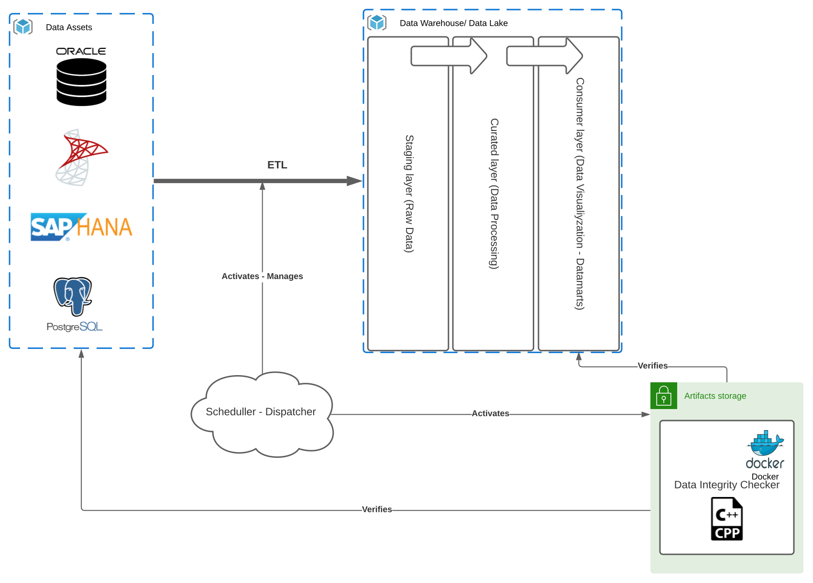

# Data Integrity Checker

## Project Overview
Purpose of this project is to create a data integrity validation software, which would be capable to to connect to the data assets as deefined on input, connect to them and compare the data between them. General focus of this project is to provide support to a Big Data processing projects, which gathers data from several data sources, for instance Oracle, MSSQL, SAP HANA, Apache HIVE, Amazon Redshift, but also flat files such as Excell, CSV, or XML and compare them against the processed equivalents in either Data Warehouse or Data Lake. This use-case can be visualized in the diagram below - Use Case Architecture.  

## Use Case Architecture

Diagram above briefly visualize general process of Data Ingestion, i.e. the process when an ETL scripts or different component on PDC (Process Dispatch Center) invocation starts data gathering from several data assets to the Data Warehouse/Lake. 

## Application description

When data is being ingested and post-processed within its Data Warehouse, respectively Data Lake, a vast amount of transformation is performed. The purpose of this project is to verify, that the data integrity was persisted. Subsections below explains general and detailed usage.

### General usage 

The compiled code will reside in the Artifactory server in form of Docker Image. This will omit any installation or platform dependencies. Automated process, either Jenkins job or Github/GitLab CI will fetch the latest snapshot in order to perform the validation. Hosting environment, therefore needs only to provide docker environment.  

### Detailed usage - solution overview

The application will provide possibility to be executed in three modes:

1. Count of record validation
⋅⋅* Unordered sub-list.
